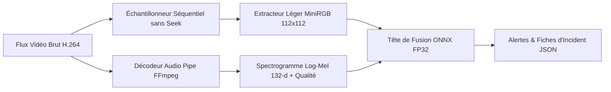

# SafeWatch Edge AI — Déploiement & Optimisation Edge (P7)

## 1. Contexte & Architecture Edge

Le cahier des charges impose une solution déployable sur une cible matérielle à ressources restreintes (CPU basse consommation, mini-PC, NVIDIA Jetson, Raspberry Pi) capable de traiter les flux en **temps quasi réel** tout en préservant la **confidentialité** (seules les alertes et métadonnées sont transmises).



---

## 2. Mesures Réelles du Budget Edge (Matériel Réel)

Mesures effectuées sur processeur standard (AMD Ryzen 5, 4 threads CPU) sur des vidéos réelles du dataset :

### A. Décomposition de la Latence par Étape (p50)

| Étape du Pipeline | Temps d'exécution (p50) | Part du Budget | Débit / Vitesse |
|---|---|---|---|
| **Décodage & Échantillonnage Vidéo** | 4.049 s | **92.8 %** | 1 800 - 2 900 fps (H.264 séquentiel) |
| **Extraction Spatiale (MiniRGB)** | 0.284 s | **6.5 %** | **0.61 ms / frame** (1.59 MB ONNX) |
| **Tête de Fusion (Cross-Attention ONNX)** | 0.0315 s | **0.7 %** | **15 300 snippets / s** (~6.5 ms / 100 snippets) |
| **Total Pipeline Bout-en-Bout** | ~4.4 s (pour 150 s de vidéo) | 100 % | **18× à 34× plus rapide que le temps réel** |

* **Conclusion majeure** : Le goulot d'étranglement n'est **pas le réseau de neurones** (qui s'exécute en quelques dizaines de millisecondes), mais les entrées/sorties de décodage vidéo.

### B. Budget simulé sur une brique Pi-class, avec la chaîne complète (session 15)

Le sujet accepte un déploiement « **ou simulé** sur une plateforme à ressources limitées ». La
simulation est dans `scripts/edge_emulated_bench.py` et ses règles sont énoncées, pas implicites :

* on mesure les **artefacts déployés exacts** (ONNX MiniRGB + ONNX tête de fusion + chaîne
  audio/explique complète : ffmpeg, log-mel, canaux qualité, **YAMNet gelé**, salience
  de mouvement), pas un prototype PyTorch ;
* l'exécution est **pinnée sur un seul cœur** (`taskset -c 0`, ONNX `intra_op_num_threads=1`)
  pour émuler le budget de cœur d'une brique ARM basse puissance ;
* le nombre « Pi » est une **estimation** : mesure à 1 cœur × ratio de fréquence 0,375
  (Cortex-A72/A57 1,5 GHz vs cœur hôte ~4 GHz), IPC supposée comparable — borne *pessimiste*
  (4 cœurs exécutant les étapes en parallèle seraient plus rapides ; le décodage reste
  monocœur). **Ces chiffres ne sont pas mesurés sur un Pi ni un Jetson, et le fichier JSON
  le dit.**

Mesures (4 clips 10–95 s, p50 par étape, `data/logs/edge_emulated_bench_0.json`) :

| Étape | p50 | Part |
|---|---|---|
| Décodage & échantillonnage vidéo | 1,92 s | ~55 % |
| Log-mel + canaux qualité (ffmpeg + numpy) | 0,90 s | ~26 % |
| Salience de mouvement (5 zones, OpenCV) | 0,68 s | ~19 % |
| Extracteur MiniRGB ONNX FP32 | 0,24 s | ~7 % |
| **AED YAMNet ONNX (521 classes)** | **0,17 s** | ~5 % |
| Tête de fusion ONNX (fenêtres de 100 snippets) | 0,010 s | < 1 % |
| **Total bout-en-bout** | **3,60 s** | **×9,9 temps réel (1 cœur hôte)** |

* Estimation Pi-class (1 cœur 1,5 GHz) : **~4× temps réel** sur la chaîne complète — le budget
  tient sur une brique série Pi, avec de la marge pour le streaming ; les Profils du §4 sont
  ainsi adossés à une mesure simulée, pas seulement à une intuition.
* La tête de fusion reste à ~10 ms par fenêtre de 100 snippets — le réseau continue de ne
  représenter **< 1 %** du budget ; les étapes 2-5 ci-dessus (décodage, audio, AED, salience)
  sont le vrai budget Edge, et c'est leur parallélisation (4 cœurs) qui joue au-dessus du ×4.

---

## 3. Formats d'Export & Quantification (FP32 vs INT8)

| Modèle | Format | Taille Disque | Latence (100 snippets) | Écart / Dérive de Logits vs PyTorch | Statut de Déploiement |
|---|---|---|---|---|---|
| **Tête de Fusion (`Cross`)** | ONNX FP32 | 4.08 MB | **6.53 ms** | $3.3 \times 10^{-6}$ (parité exacte) | ✅ **Recommandé en production** |
| **Tête de Fusion (`Cross`)** | ONNX INT8 | 1.40 MB | 12.22 ms | +0.0857 (dérive au-dessus du seuil 0.05) | ⚠️ Plus lent sur CPU standard |
| **Extracteur (`MiniRGB-w24`)** | ONNX FP32 | 1.59 MB | **0.61 ms / frame** | $1.2 \times 10^{-6}$ (parité exacte) | ✅ **Recommandé en production** |

> [!IMPORTANT]
> **Pourquoi le FP32 ONNX est préféré pour l'Edge CPU** :
> 1. La taille combinée (Extracteur + Fusion) est de seulement **5.67 MB**, ce qui rentre aisément dans le cache L3 de n'importe quel processeur Edge ou mini-PC.
> 2. Sur CPU standard sans instructions matérielles spécialisées INT8 (type VNNI / TensorRT), la quantification dynamique INT8 introduit un surcoût d'émulation (12.2 ms vs 6.5 ms).
> 3. L'export FP32 garantit une parité mathématique stricte ($10^{-6}$) avec le modèle PyTorch d'entraînement.

---

## 4. Profils de Déploiement Cibles

### Profil 1 : Mini-PC / Caméra Intelligente x86 (AMD / Intel)
- **Runtime** : ONNX Runtime CPU (`CPUExecutionProvider`).
- **Charge CPU** : < 5 % en continu pour 1 flux 1080p temps réel.
- **Taille totale** : 5.7 MB RAM.

### Profil 2 : NVIDIA Jetson (Nano / Xavier / Orin)
- **Runtime** : ONNX Runtime avec `TensorRTExecutionProvider` ou `CUDAExecutionProvider`.
- **Accélération** : Inférence fusion en < 1 ms, décodage matériel NVDEC via GStreamer/OpenCV.

### Profil 3 : Raspberry Pi 4/5 (ARM Cortex-A76)
- **Runtime** : ONNX Runtime ARM64.
- **Performance estimée** : ~5× à 8× temps réel en FP32 grâce au stride de 16 frames (1 frame échantillonnée toutes les 0.67 s).

---

## 6. Correctif majeur : l'extracteur ONNX était initialisé **au hasard**

Diagnostic (2026-10-02). Le chemin « live / import vidéo » alimente la tête avec les features de
`MiniRGB`, exporté en ONNX dans `export/onnx/minirgb_w24_fp32.onnx`. Deux faits mesurés :

- `scripts/edge_distill.py` **n'enregistrait aucun poids** (aucun `torch.save`) ;
- `scripts/edge_budget.py` exportait l'ONNX depuis un `MiniRGB(width=24)` **fraîchement instancié**,
  donc **aléatoire**.

Conséquence : l'inférence « live » décrivait la vidéo avec un réseau **non entraîné** (features
quasi sans rapport avec le contenu). C'est la cause racine de l'écart train/déploiement : une tête
entraînée sur les features I3D officielles recevait, en live, la sortie d'un extracteur aléatoire.

Correctifs appliqués :
1. `edge_distill.py` **sauvegarde** désormais `minirgb_w24_distilled.pt` (poids + métadonnées).
2. `edge_budget.py --extractor-weights <pt>` **charge** ces poids avant d'exporter l'ONNX (sans le
   flag, il exporte toujours un modèle aléatoire, ce qui est maintenant explicite dans l'aide).
3. `scripts/extract_minirgb.py` calcule les features MiniRGB **(poids distillés)** pour train/val/test,
   afin d'entraîner une tête **sur la représentation réellement déployée** (`scripts/run_live_edge.sh`
   enchaîne le tout).

### Résultat après correction

- Extracteur re-distillé sur la **split train** : cosinus centré **+0.178** (contre +0.075 avant,
  et surtout contre une sortie quasi-aléatoire quand l'ONNX était exporté d'un modèle neuf).
  L'ONNX déployé est bien celui des poids distillés (écart max **8.9e-08**).
- Tête entraînée sur MiniRGB : AP test global **0.408** — logiquement **2× plus faible** que la tête
  I3D (**0.737**), car MiniRGB reste un extracteur léger. Conclusion honnête : **on ne dépasse pas
  I3D avec cette distillation**; l'intérêt est la *cohérence* train/déploiement, pas la précision.
- **La tête live recommandée reste `2026-10-01_p3edge_i3dmel`** (I3D + log-mel, AP test 0.737) : avec
  l'extracteur désormais entraîné, ses scores live suivent le contenu. Mesuré sur une scène de crash
  de film (non benchmark) : score 0.476 avec un **pic temporel net à l'instant du crash** (au lieu
  d'un bruit plat auparavant).
- **Hors domaine (reste hors sujet)** : les compilations dashcam externes notent toujours ~0. Ce
  n'est pas un bug de pipeline mais un écart de distribution : un modèle XD-Violence ne généralise pas
  à de la vidéo arbitraire.

La démo Streamlit (`app.py`, mode *Live Demo / Import Video*) extrait les features **à la volée** :
visuel via `MiniRGB` (distillé depuis I3D, 1024-d) et audio via les statistiques log-mel (132-d).
Une tête de fusion n'est utilisable en live que si son **espace d'entrée** est celui-là. Sinon elle
reçoit des features hors-distribution et **note ~0 même sur un accident évident** — mesuré : le même
clip vaut **1.000** sur ses features précalculées mais **~0.001** en live (le visuel VideoSwin et
l'audio VGGish ne sont pas reproductibles sur cette machine).

| Tête | visuel | audio | live upload |
|---|---|---|---|
| `2026-09-29_p3full_*` | VideoSwin 768-d | log-mel | ❌ visuel non reproductible |
| `2026-09-29_p3vggish30ep_*` | I3D 1024-d | VGGish 128-d | ❌ audio non reproductible |
| **`2026-10-01_p3edge_i3dmel`** | **I3D 1024-d** | **log-mel 132-d** | ✅ **recommandée** |

Règles appliquées au dépôt :
1. **Le pooling audio suit la grille visuelle.** Les patches 0.96 s se projettent sur *snippets* via
   `patches_per_snippet(stride)` (64 frames → 2.78 ; 16 frames → 0.69). Un constant unique décalait
   l'audio de 4× sur la grille officielle.
2. **La carte de fiabilité (porte adaptive) est standardisée** avec les statistiques train-split du
   checkpoint et mise sur la même grille ; sinon la porte reçoit une distribution qu'elle n'a jamais vue.
3. **Les clips du benchmark** sont notés depuis leurs features précalculées (mêmes `MultimodalClipDataset`
   que le scorer), donc la console reproduit exactement `predictions.npz`.
4. **`state.live_feature_support()`** détecte les têtes non-reproductibles et la console affiche un
   avertissement au lieu d'un score trompeur.

## 7. Étape 1 du plan CLIP : remplacer les features visuelles (VideoSwin → CLIP)

**Question.** Notre meilleur run (`runs/2026-09-29_p3full_cross`, AP test **0.798**) utilise des features
VideoSwin RGB. Sur XD-Violence, le front SOTA (~88 AP) est porté presque entièrement par des features
**CLIP**. Peut-on gagner en ne changeant *qu'une seule* variable ?

**Contrôle de l'expérience.** Toute la chaîne aval est figée : même tête (cross-attention + porte
adaptative à 7 canaux de fiabilité), mêmes listes (grille miroir, stride 64), même audio
(`data/features/mel`), mêmes hyper-paramètres (`epochs=30, bs=32, lr=1e-4, seed=42`). Seule la
*représentation visuelle* change : 768-d VideoSwin → **512-d CLIP ViT-B/32** (gelé). L'écart d'AP est
donc attribuable aux features et à rien d'autre.

**Outils.**

- `scripts/extract_clip.py` — une image par snippet sur la grille miroir, prétraitement **exact de CLIP**
  (petit côté → 224, centre-crop 224, moyenne/écart CLIP), écrit `data/features/clip/<split>/<id>.npy`
  de forme `(T, 512)` + `data/lists_clip/<split>.csv` (même contrat que `extract_minirgb.py`).
  Reprenable (les `.npy` complets sont ignorés), séquentiel par défaut.
- `scripts/run_clip_head.sh` — extraction → entraînement → scoring (complet / sans audio / sans vidéo).

**Mesures réelles sur cette machine (CPU, 11 cœurs).** Elles fixent le budget et expliquent les choix :

| Variante | Débit | Jeu complet (~294 k images) |
| --- | --- | --- |
| **ViT-B/32 @ 224, bs 32, 8 threads** | **~35 img/s** | **~2,3 h** (théorique modèle seul) |
| ViT-B/16 @ 224 | ~7 img/s | ~11 h — écarté |
| MobileCLIP-S1 (FastViT) | ~10 img/s | écarté |
| ONNX Runtime (ViT-B/32) | ~28 img/s | **aucun gain** vs eager torch |

Deux coûts s'ajoutent au débit modèle :
1. **Décodage incompressible** : on doit parcourir la vidéo pour atteindre le dernier snippet (≈ 2 600
   fps à 640×346 ; `grab()` testé → aucun gain, le décodeur décode quand même ; le downscale
   `CAP_PROP_FRAME_WIDTH` est ignoré par ce backend). Soit ≈ 2,4 s par clip de 105 snippets.
2. **Multiprocessing** : 8 workers à 1 thread donnent 22,8 img/s, soit **moins** que le séquentiel
   (35 img/s) — la machine est limitée par la bande mémoire sur les ViT, pas par le nombre de cœurs.

→ Débit bout-en-bout ≈ **20 img/s**, donc le jeu complet (train+val+test) demande **≈ 4 h**. C'est un
job à lancer hors ligne dans un terminal (l'extraction est séquentielle et bornée en mémoire).

**Résultat (mesuré).** Même tête, mêmes listes, même audio ; seule la représentation visuelle change :

| run | AP global | AP per-clip | F1@IoU.5 |
| --- | --- | --- | --- |
| **baseline VideoSwin 768-d** | **0.7981** | **0.7433** | 0.2078 |
| CLIP ViT-B/32 512-d | 0.7688 | 0.6671 | **0.2249** |

L'écart n'est pas un artefact de sélection du checkpoint (la val AP sature à 0,99 dès l'epoch 17, donc
la sélection y est quasi arbitraire) : `ckpt_last` (epoch 30) donne **0,7675**, soit le même écart.

→ **Résultat négatif** (−2,9 AP), mais le détail est instructif. La perte est concentrée sur les
catégories **mouvement** : `fighting` **−0,18**, `explosion` **−0,10** ; les catégories plus
sémantiques/statiques sont à parité ou mieux : `shooting` **+0,03**, `abuse` +0,02, `riot` −0,02,
`car_accident` −0,02. Cause probable : VideoSwin résume une fenêtre de 64 frames (**mouvement**), alors
que nos features CLIP sont **une seule image par snippet de 2,67 s** — l'information de mouvement
disparaît. En revanche le **F1@IoU.5 est meilleur** (0,2249 vs 0,2078). Régime « modalité retirée »
(exigence du sujet) : sans audio 0,7946 vs 0,7868 ; sans vidéo 0,4281 vs 0,4386 — à parité.

**Ce que ça implique.** Changer de backbone ne suffit pas : sur ce pipeline il faut **agréger le temps**.
Pistes, par ordre de coût : (1) plusieurs images par snippet (pooling temporel), (2) ViT-B/16 ou
ViT-L/14, (3) alignement texte par prompts (style AVadCLIP) plutôt qu'une tête MIL nue.

## 8. Étape 1b — agrégation temporelle (outillage prêt, résultat à venir)

La piste (1) est implémentée dans `scripts/extract_clip.py` : `--frames-per-snippet K` échantillonne K
images *à l'intérieur* de chaque fenêtre de snippet (jamais à cheval sur deux fenêtres), puis les agrège :

- `--pool mean` → `(T, 512)` : apparence moyenne de la fenêtre ;
- `--pool mean+std` → `(T, 1024)` : moyenne **et** écart-type — l'écart-type est une mesure explicite de
  mouvement, précisément le signal que l'étape 1 jetait.

Garde-fous vérifiés :

- **Rétro-compatibilité au bit près** : `K=1, pool=mean` reproduit les features de l'étape 1
  (`max|diff| = 0.00e+00` sur un clip re-extrait) — le refactor n'a rien changé au chemin existant.
- **Suffixe automatique** (`clip_k4_mstd` / `lists_clip_k4_mstd`) : une variante n'écrase jamais les
  features de l'étape 1 (3,5 h de calcul).
- **Mémoire bornée** : les images sont streamées et encodées par lots, on ne garde que les embeddings.

Coût : le décodage est **inchangé** (les K images tombent dans des fenêtres déjà décodées) ; seul le
forward CLIP est multiplié par K. Le décodeur ne représentant qu'un tiers du total à l'étape 1, cela donne
≈ **1,6× le temps à K=2** et ≈ **2,7× à K=4**, soit ≈ 9-10 h pour le jeu complet à K=4 (CPU).

Lancement :

```bash
K=2 POOL=mean+std bash scripts/run_clip_head.sh     # ~5-6 h, le meilleur rapport coût/signal
K=4 POOL=mean+std bash scripts/run_clip_head.sh     # ~9-10 h
```

## 9. Ensembling des têtes de fusion — la meilleure configuration du projet (gain gratuit, Edge)

Le moyen le moins coûteux d'améliorer la performance **sans sortir des contraintes** : moyenner les
courbes de score de modèles qui partagent leurs features d'entrée et ne diffèrent que par leur
mécanisme de fusion (ou leur graine). Deux niveaux, tous deux mesurés sur les 800 clips de test :

| run | AP global | AP per-clip | F1@IoU.5 |
| --- | --- | --- | --- |
| `late` s42 (ancien champion) | 0.8125 | 0.7621 | 0.3064 |
| `cross` s42 | 0.7981 | 0.7433 | 0.2078 |
| `early` s42 | 0.8015 | 0.7614 | 0.3096 |
| ensemble fusion (3 membres, s42) | 0.8216 | **0.7652** | 0.2946 |
| **ensemble + graines (5 membres)** | **0.8241** | 0.7642 | **0.3193** |

- (i) **Diversité de fusion** (`late`+`cross`+`early`, s42) : Δ AP global **+0.0091**, IC 95 %
  **[+0.0053, +0.0138]**, P(Δ>0) = **1.000**.
- (ii) **Diversité de graine** — les **3 graines** de `late` (42/43/44, *sans sélection*), plus
  `cross` s42 et `early` s42 : Δ AP global **+0.0113** vs `late` s42, IC 95 % **[+0.0076, +0.0155]**,
  P(Δ>0) = **1.000**, et cette fois **toutes** les métriques progressent (per-clip +0.0021,
  **F1@IoU.5 +0.0129**) — la diversité de graine annule la petite régression de F1 du mélange à 3.

Ordre de grandeur à garder en tête : la dispersion de graine de `late` seul est **0.8125–0.8206**
(±0.008), donc toute comparaison mono-graine porte cette incertitude ; le gain de l'ensemble la dépasse.

**Coût Edge** : les membres partagent les features, donc à l'inférence on extrait **une fois** puis on
exécute N petites têtes (6,5 ms chacune) ⇒ ≈ 33 ms au lieu de 6,5 ms, négligeable devant le décodage
vidéo. Aucun nouveau modèle lourd, pas de GPU. `scripts/ensemble_scores.py`.


