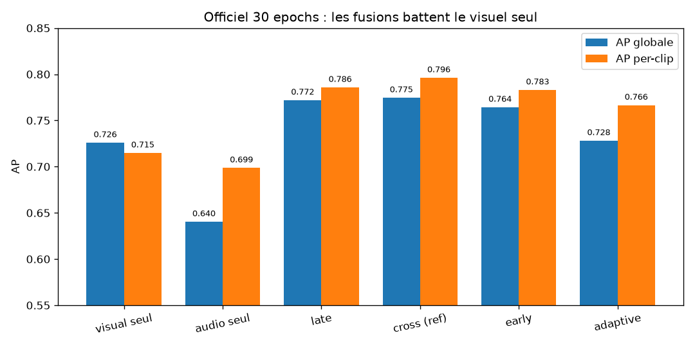
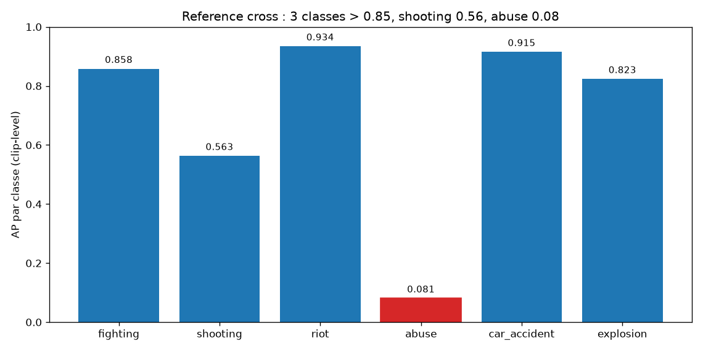
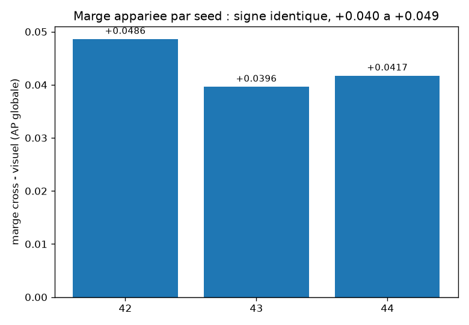
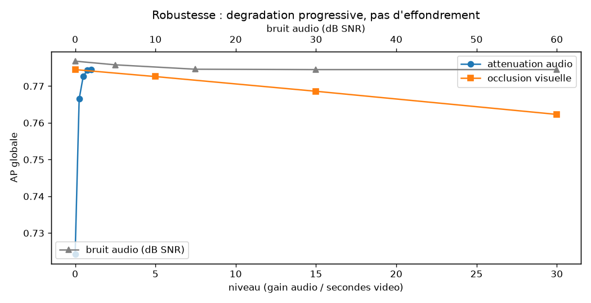
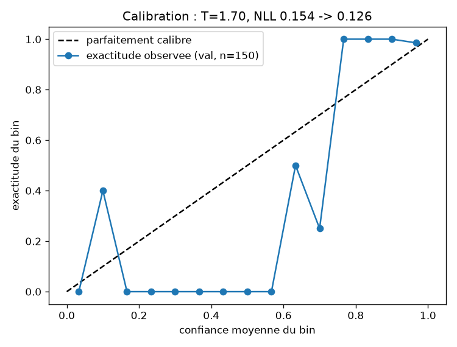

# SafeWatch — rapport final : détection audio-visuelle d'incidents sous supervision faible

> Chaque nombre cite son run source dans `runs/` ; aucun chiffre n'est cité de mémoire.
> Règles de comparabilité : `docs/protocol.md` §4. Chronologie des décisions : `docs/journal.md`.
> Brief jury : `docs/avancement.md`. Figures : `docs/report/figures/`.

## 1. Sujet, protocole et périmètre

Détection d'incidents **audio-visuelle** faiblement supervisée (labels au niveau clip),
avec catégorisation (6 classes : fighting, shooting, riot, abuse, car_accident, explosion),
**localisation temporelle**, explication et budget Edge. Benchmark : **XD-Violence**
(Wu et al., ECCV 2020), via le miroir `jherng/xd-violence` et les features officielles.

- Splits miroir : 3 516 train / 434 val / 800 test (`data/lists/`) ; grille officielle :
  3 804 train / 150 val / 800 test (`data/lists_official/`).
- Deux grilles : miroir **64 frames/snippet** (VideoSwin 768-d), officielle **16 frames/snippet**
  (I3D 1024-d). Audio : log-mel patch stats 132-d (miroir) / **VGGish officiel 128-d**.
- Métriques : AP **globale** (compatible Wu) × **per-clip** (moyenne des 800 AP par clip),
  F1 segmentaire @tIoU 0.1–0.5, IoU moyen, délai de détection, AP par classe.
- Règle de comparabilité centrale : nos chiffres ne sont comparables qu'**entre eux**
  (mêmes features, mêmes listes, même code) — jamais aux valeurs publiées, nos features
  étant re-baselinées (§6.1). P4 streaming : le scoring causal est **fait** (`--causal-prefix-stride`,
  §4.5) — le coût mesuré et ses dégradations sont chiffrés, pas supposés.
- Qualité logicielle : **90 tests verts** (13 metrics + 41 pipeline + 17 explain +
  8 analysis + 11 UI), `ruff` propre, console de supervision P6 (`app.py`).

## 2. Résultats principaux (test officiel, 800 clips, 30 epochs)



| run | AP global | AP per-clip | IoU moy. | F1@0.5 | seeds (AP globale) |
|---|---|---|---|---|---|
| `p2vggish30ep_visual` (référence visuelle) | 0.7259 | 0.7148 | 0.208 | 0.201 | 3 · 0.7259–0.7323 · moy. **0.7287** |
| `p2vggish30ep_audio` (audio seul, VGGish) | 0.6403 | 0.6986 | 0.205 | 0.200 | 1 |
| `p3vggish30ep_late` | 0.7719 | 0.7857 | 0.247 | 0.258 | 1 |
| **`p3vggish30ep_cross` (référence)** | **0.7745** | **0.7961** | **0.260** | 0.239 | 3 · 0.7695–0.7745 · moy. **0.7720** |
| `p3vggish30ep_early` | 0.7643 | 0.7830 | 0.242 | 0.256 | 1 |
| `p3vggish30ep_adaptive` | 0.7281 ⚠ | 0.7665 | 0.228 | 0.180 | 3 · **0.6319**–0.7281 · moy. **0.6900** |

`cross`, `late` et `early` battent la référence visuelle sur les deux protocoles AP
(+0.036 à +0.043 global, +0.068 à +0.081 per-clip). **`adaptive` fait exception** : c'est le
seul variant à 3 seeds dont la moyenne globale (**0.6900**) passe *sous* la référence visuelle
(0.7287), avec une dispersion de **0.096** ; sur le per-clip sa marge (+0.015) tient dans sa
propre dispersion (0.057). Le variant à portail ne démontre donc **rien** face au visuel seul —
cohérent avec §5.1, et sa ligne du tableau (0.7281) est sa **meilleure** seed, pas sa valeur
attendue. `late`/`early` restent à 1 seed : l'ordre *entre* fusions n'est pas une revendication
(§2.2). Table reproductible : `scripts/ladder_seed_check.py` → `data/logs/ladder_seed_table.txt`.

### 2.1 Par classe (référence `cross`)



| classe | fighting | shooting | riot | abuse | car_accident | explosion |
|---|---|---|---|---|---|---|
| AP | 0.858 | 0.563 | 0.934 | **0.081** | 0.915 | 0.823 |

Trois classes dépassent 0.85, `shooting` plafonne à 0.56, et `abuse` s'effondre à
0.08 : c'est une famine de données (50 clips train / 3 804), pas un défaut
d'architecture — voir §5.4.

### 2.2 Marges seed : ce qui est démontré, ce qui ne l'est pas



`cross` 0.7695–0.7745 (3 seeds) vs visuel 0.7259–0.7323 (3 seeds) :
marge appariée moyenne **+0.0433** (plage +0.0396 à +0.0486), soit **~6.7× la
dispersion** la plus large (`scripts/seed_margin.py`,
`data/logs/seed_margin_table.txt`). Le signe est identique sur les 3 seeds.
En revanche les rangs `late`/`early` sont à 1 seed : l'ordre *entre* fusions n'est
pas revendiqué. Et « la fusion bat sa référence » ne vaut que pour
`cross`/`late`/`early` — à 3 seeds **`adaptive` perd** contre le visuel seul
(moyenne globale 0.6900 vs 0.7287), donc il ne figure dans aucune revendication.
Corollaire : `cross` et le visuel bougent de 0.005–0.007 entre seeds alors que
l'`adaptive` oscille de **0.096** — c'est spécifiquement le variant à portail
qui est instable, argument supplémentaire pour l'écarter (§5.1).

## 3. Méthode en bref

Backbone MIL faiblement supervisé (~0.9 M paramètres, features gelées, CPU) :
encodeurs visuel/audio → 4 têtes de fusion (`late`, `cross`, `early`, `adaptive`
à portail de fiabilité 7 canaux) → pooling top-k → scores clip + multi-labels.
Reliability : statistiques audio + 2 proxies visuels, standardisés sur le train
officiel (`quality_stats_official.json`). Grilles : alignement snippet exact —
un bug de scorer qui poolait le VGGish comme du mel a un temps gonflé l'écart
global↔per-clip avant correction (confession : `docs/journal.md` Session 8 ;
l'audio seul passait de 0.366 à 0.640 une fois aligné).

## 4. Revendications tenables : preuves et conditions

### 4.1 La fusion bat sa référence visuelle (démontré, 3 seeds)
Marge appariée +0.0433 global / +0.078 per-clip (3 seeds, `scripts/seed_margin.py`,
`data/logs/seed_margin_table.txt`). Audit hors-source : les clips de sources inédites
scorent **mieux**, pas moins bien (pas de fuite). Ablation de modalité sur `cross` :
−audio → 0.7243 (−0.050), −vidéo → 0.6563 (−0.118) : les deux modalités contribuent.

### 4.2 Le défaut audio était la représentation (démontré)
Audio seul : mel 132-d 0.446 global / 0.625 per-clip → VGGish 128-d **0.640 / 0.699**.
L'écart global↔per-clip se referme : le problème de gain/offset inter-clips venait
largement des features, pas de la calibration (dont l'échec est mesuré §5.2).

### 4.3 Robustesse : dégradation progressive, pas d'effondrement (mesuré)



Balayages 4 familles (`data/logs/robustness_table.txt`, `scripts/robustness_table.py`) :
atténuation audio 0 → −0.050 ; occlusion visuelle 30 s → −0.012 ; bruit 0 dB → −0.002.
L'IoU bouge peu (0.369 → 0.351–0.371) : la localisation survit à la dégradation.

### 4.4 Tête Edge exportable (mesuré)
`export/onnx/2026-09-29_p3vggish30ep_cross_report.json` : fp32 **4.083 MB**,
parité 3.8e-06, **p50 5.2 ms / 100 snippets** (≈ 4.4 min de vidéo). La tête n'est pas
le goulot — c'est l'extraction de features.

### 4.5 Scoring causal / streaming (P4, mesuré)

Tous les chiffres ci-dessus viennent d'une passe **non-causale** : l'attention agrège les
`T` snippets du clip entier. Un système déployé ne le peut pas — au snippet `t` il ne
dispose que de `t` snippets. `--causal-prefix-stride K` re-diffuse des préfixes espacés de
`K` snippets et ne conserve que le score en fin de préfixe (maintien par palier) :
le snippet `t` ne voit donc **jamais** le futur. Coût mesuré : `K=1` (exact) = **182×**
la passe offline, `K=8` = **23×**. Les sept runs (références + seeds) se scorent en
**~13 min** au total sur CPU (`scripts/run_causal_score.sh`, table : `data/logs/causal_table.txt`).

| run | mode | AP glob. | AP per-clip | F1@0.5 | délai (s) | IoU moy. |
|---|---|---|---|---|---|---|
| `cross` | offline | 0.7745 | 0.7961 | 0.239 | 17.7 | 0.260 |
| `cross` | **causal K=8** | **0.6964** | 0.6118 | 0.208 | 13.5 | 0.297 |
| `late` | offline | 0.7719 | 0.7857 | 0.259 | 31.5 | 0.247 |
| `late` | **causal K=8** | **0.6951** | 0.6328 | 0.197 | 31.2 | 0.250 |
| visuel seul | offline | 0.7259 | 0.7148 | 0.201 | 35.3 | 0.208 |
| visuel seul | **causal K=8** | **0.6521** | 0.6112 | 0.181 | 31.6 | 0.240 |

**Le premier jet (seed 42 seul) a été rejoué sur 3 seeds** (`cross`/`visual` en `s42/s43/s44`,
matrices : `data/logs/causal_seed_matrix.txt`), parce que la marge `cross − visuel` en offline,
elle, est répliquée. Ce contrôle a **corrigé une conclusion** :

1. **Le coût du streaming est robuste** (même signe sur les 6 cellules seed × modèle) :
   AP globale **−0.072 à −0.090**, AP per-clip **−0.10 (visuel) à −0.19 (cross)**, F1@0.5
   **−0.020 à −0.049**. ~10 % d'AP en moins, systématiquement. Le mécanisme est le maintien
   par palier : il crée des ex-æquo *dans* un clip, ce qui pénalise le classement intra-clip.
2. **La localisation, en revanche, NE résiste PAS au contrôle de seed** — la lecture
   initiale (« délai qui baisse, IoU qui monte ») était un artefact de la seed 42 :
   l'IoU va de **−0.097 à +0.037** et le délai de **−4.2 s à +7.9 s**, signe **inversé**
   selon la seed. Pire : le délai **offline lui-même** varie de **0.2 s à 17.7 s** selon la
   seed ⇒ c'est une métrique instable qu'on ne peut pas citer à n=1. Conclusion honnête :
   on ne peut **rien** affirmer sur l'effet du streaming sur la localisation.
3. **L'avantage de la fusion survit, mais plus faiblement** : marge appariée
   `cross − visuel` sur 3 seeds = **+0.0334** (range +0.0245 à +0.0442), en causal, contre
   **+0.0433** en offline. Positive sur les 3 seeds, et supérieure à la dispersion la plus
   large (0.0145) — donc tenue — mais le rapport marge/dispersion tombe de **6.7× à 2.3×**,
   et la dispersion causale de `cross` (0.0145) est **3×** celle de l'offline (0.0050).
   Autrement dit : **le streaming rend le modèle plus sensible à la seed**, et la valeur
   single-seed citée au premier jet (+0.0442) était la plus optimiste des trois.

Conséquence honnête : le modèle *est* déployable en flux à ~10 % d'AP près (chiffre robuste) ;
l'effet sur la localisation n'est **pas** établi et ne doit pas être présenté comme un gain.

## 5. Résultats négatifs (assumés, pas cachés)

### 5.1 Portail de fiabilité : gain non démontré
2 seeds positifs sur 3, moyenne +0.015 — mais dispersion propre du `adaptive` : **0.096**,
soit 6× l'effet (`docs/avancement.md` §3.4). **Retiré des arguments du rapport.**

### 5.2 Calibration : trois méthodes, aucune ne gagne sur la tête catégorielle
Norme par clip : audio seul 0.446 → 0.329 (détruit), per-clip 0.625 → 0.593.
Température **globale** (`calibration.json`, val 150 clips) : T=1.70, NLL 0.154 → 0.126 mais
ECE 0.0421 → 0.0427 (inchangé) — elle optimise la NLL, pas l'ECE.



**Température par classe** (`scripts/fit_calibration.py --per-class`, table
`data/logs/perclass_calib_table.txt`), 6 têtes, ECE mesuré sur les 800 clips test, T ajusté sur val :

| macro ECE (test) | non calibré | par classe | T globale unique |
|---|---|---|---|
| `cross` | **0.0738** | 0.0810 | 0.1100 |
| `late` | 0.0426 | **0.0425** | 0.0676 |

Trois verdicts, tous négatifs ou neutres :
1. **La température globale est nuisible** à cette tête (0.0738→0.1100 ; 0.0426→0.0676) : elle a
   été ajustée sur le score d'anomalie *clip*, et l'appliquer aux 6 probabilités de catégorie
   sur-écrase la distribution.
2. **La calibration par classe n'est pas fiable** : sur `cross` elle *dégrade* l'ECE (4 têtes
   aggravées sur 5 ajustées), sur `late` c'est une égalité à 1e-4. Aucune des deux n'égale
   « ne rien faire ».
3. **`abuse` est incalibrable** : la val officielle ne contient **aucun** clip `abuse` (0/150) ⇒
   pas de positif, donc pas d'ajustement ; T=1 imposé et **signalé** (`unfitted`), pour qu'un
   opérateur ne lise pas « abuse 12 % » comme une probabilité calibrée.

Cause racine : la mise à l'échelle par température minimise la NLL, **pas** l'ECE — d'où une ECE
qui peut empirer *même sur la val* (`cross` : macro 0.0755 → 0.0774). Viser l'ECE demanderait une
méthode dont c'est l'objectif (régression isotone / histogram binning), hors périmètre ici.
Conclusion utilisable : **laisser la tête catégorielle non calibrée** et afficher la catégorie
comme un *rang*, pas comme une probabilité — ce que fait la carte d'alerte.

### 5.3 int8 : refusé trois fois (reproduit)
Décalage de logits 0.13 > tolérance 0.05 **et** ralentissement ×0.41 sur ce graphe
(`export/onnx/*_report.json`). Négatif reproduit, pas un accident.

### 5.4 `abuse` : famine de données, pas d'algorithme
50 clips train / 3 804 ; AP 0.03–0.14 selon le run (référence : 0.081).
Repondération testée : échec (dépend du mode de fusion). Piste : relabelliser /
sur-échantillonner / fusionner la classe — pas un nouveau tweak de loss.

## 6. Limites à dire au jury

1. Chiffres **re-baselinés** sur nos features : non comparables à la littérature.
2. Grille officielle plafonnée par le backbone I3D (0.726) vs VideoSwin miroir (0.810) ;
   toute comparaison inter-grilles se fait **à backbone égal**.
3. Canaux visuels de fiabilité = **proxies** (pas de pixels décodés).
4. Localisation modeste : F1@0.5 ≈ 0.24, délai ~18 s pour la référence `cross`
   sur la grille officielle (late/early ~31.5 s, visuel seul 35.3 s ; miroir :
   0.306 / 11.4 s). ⚠️ Le **délai est une métrique instable** : sur les 3 seeds de `cross`
   il vaut 17.7 / 3.5 / 0.2 s ⇒ aucune conclusion de localisation ne peut être tirée à n=1
   (§4.5). En causal (§4.5), l'AP perd ~10 % de façon robuste ; l'effet sur la localisation
   n'est **pas** établi. Ce n'est toujours pas un système d'alerte temps réel — c'est un
   détecteur **quasi-temps-réel** dont le coût de causalité est désormais mesuré.
5. Machine **sans GPU** : modèles sur features gelées (~0.9 M paramètres).

## 7. Chaîne de reproduction

```bash
bash scripts/run_p3_vggish.sh              # smoke 2 epochs
EPOCHS=30 bash scripts/run_p3_vggish.sh    # échelle complète (~12 h CPU)
.venv/bin/python scripts/seed_margin.py --margin p3vggish30ep_cross p2vggish30ep_visual
.venv/bin/python scripts/ladder_seed_check.py   # §2 : quels rangs sont répliqués ?
.venv/bin/python scripts/robustness_table.py
bash scripts/run_causal_score.sh            # P4 streaming/causal (§4.5, ~7 min CPU)
.venv/bin/python scripts/fit_calibration.py --ckpt <run>/ckpt_best.pt --per-class --test  # P5 §5.2
.venv/bin/python -m pytest -q              # 93 tests : 13 metrics + 41 pipeline + 20 explain + 8 analysis + 11 UI
.venv/bin/python -m ruff check .           # propre
.venv/bin/python -m streamlit run app.py   # console P6
.venv/bin/python scripts/make_report_figures.py  # régénère docs/report/figures/fig1-5.png
```

## 8. Reste à faire (priorités)

1. ~~Squelette~~ ce rapport → relecture + vidéo de démonstration.
2. ~~P4 : scoring **causal/streaming**~~ **fait et contrôlé sur seeds** (§4.5,
   `scripts/run_causal_score.sh`) ; reste : baisser `K` vers 1 sur une machine plus rapide.
3. ~~P5 : calibration **par classe**~~ **fait** (§5.2, résultat négatif/neutre : la température
   globale *dégrade* la tête catégorielle, la calibration par classe ne la sauve pas, `abuse`
   est incalibrable faute de positif en val).
4. P7 : **extracteur léger** (le goulot, pas la tête).
5. Seeds des rangs intermédiaires (`late`, `early`) si l'ordre entre fusions est revendiqué.
